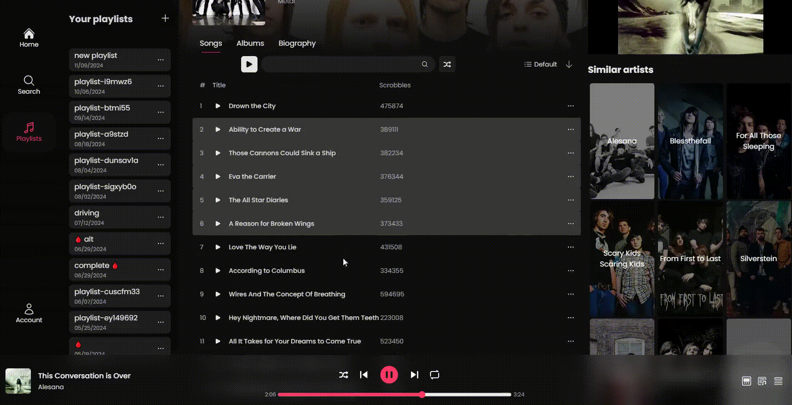
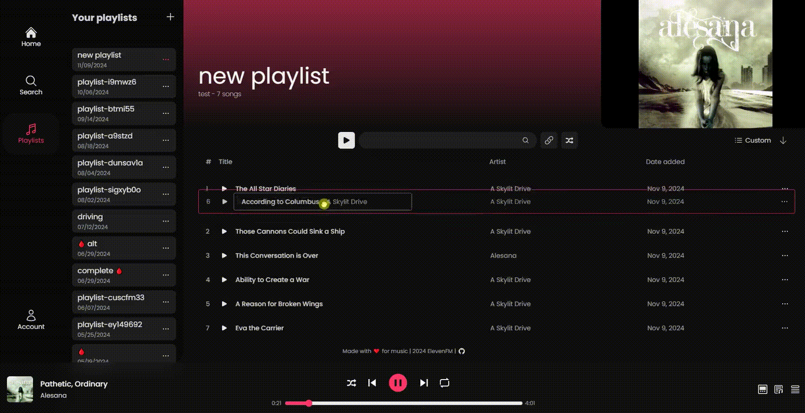

# ElevenFM

A music streaming webapp that uses YouTube to get the audio and video. The artist and album data is provided by Last.fm and TheAudioDB APIs.

## Tech Stack

- [Next.js](https://nextjs.org/)
- [ORPC](https://orpc.unnoq.com/)
- [Tanstack Query](https://tanstack.com/query/)
- [Better Auth](https://www.better-auth.com/)
- [TailwindCSS](https://tailwindcss.com/)
- [Drizzle ORM](https://orm.drizzle.team/)
- [Turso](https://turso.tech/)
- [DndKit](https://dndkit.com/)
- [Framer Motion](https://www.framer.com/motion/)
- [Zustand](https://zustand-demo.pmnd.rs/)

## Features

- **Search** for artists (Ctrl+K)
- View artist details and discography
- **Play** albums and tracks
- Autoplay artist's tracks
- Add tracks to **queue**
- View **lyrics**
- Randomize the queue
- Manage playlists with drag and drop reordering
- **Import** playlists from Spotify, YouTube and SoundCloud
- **Drag and drop** Spotify songs directly into playlists
- Simple account creation with username-based auth
- Fully responsive design

  | Add songs to your playlists by dragging and dropping: | Reorder tracks in your playlists:          |
  | ----------------------------------------------------- | ------------------------------------------ |
  |                  |  |

## Installation

Clone the repository and run `pnpm install` to install the dependencies. Then run `pnpm run db:migrate` to create the database, on development it will create a local SQLite database file, on production it receives a Turso connection URL and auth token as environment variables.
Finally `pnpm run dev` to start the development server.

## Environment variables

- `LASTFM_API_KEY` - Last.fm API key
- `AUDIODB_API_KEY` - TheAudioDB API key
- `GENIUS_ACCESS_TOKEN` - Genius API access token for lyrics
- `NEXT_PUBLIC_INVIDIOUS_URLS` - Invidious instances to get YouTube video embeds
- `NEXT_PUBLIC_SITE_URL` - Site URL for CORS
- `TURSO_CONNECTION_URL` and `TURSO_AUTH_TOKEN` - [Turso](https://docs.turso.tech/sdk/ts/quickstart) variables
- `UPSTASH_REDIS_URL` and `UPSTASH_REDIS_TOKEN` - [Upstash](https://upstash.com/) Redis variables for sessions

### Better Auth variables

- `BETTER_AUTH_SECRET` - Secret key for Better Auth
- `BETTER_AUTH_URL` - Base URL for authentication

## Other commands

- `pnpm run build` - Build the app for production
- `pnpm run db:push` - Push database schema changes
- `pnpm run db:studio` - Open Drizzle Studio for database management
- `pnpm run db:generate` - Generate database migrations

## Motivation

Many songs I like were not available on Spotify and some never got lyrics, some were only available on SoundCloud or YouTube, and I don't like Youtube Music interface and ads. Also I didn't want to bother with managing or self-hosting my own music library. So I decided to make my own music streaming platform.
