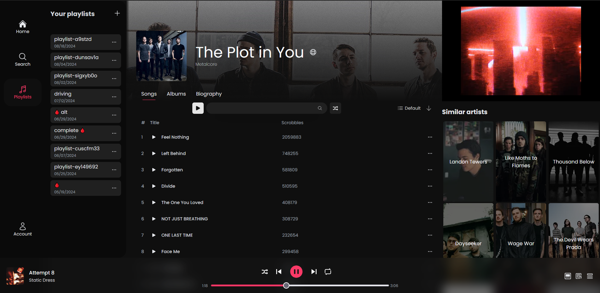

# ElevenFM

A music streaming webapp that uses YouTube to get the audio and video. The artist and album data is provided by Last.fm and TheAudioDB APIs.

## Tech Stack

- [Next.js](https://nextjs.org/)
- [Apollo Server](https://www.apollographql.com/docs/apollo-server/) with [TypeGraphQL](https://typegraphql.com/)
- [Tanstack Query](https://tanstack.com/query/) for communication with the GraphQL server
- [Auth.js](https://authjs.dev/)
- [TailwindCSS](https://tailwindcss.com/)
- [Drizzle ORM](https://orm.drizzle.team/)
- [Turso](https://turso.tech/) for SQLite database
- [DndKit](https://dndkit.com/) for sorting and drag and drop

## Features

- Search for artists.
- View artist details and discography.
- Play albums and tracks.
- Autoplay artist's tracks.
- Add tracks to queue.
- View lyrics.
- Randomize the queue.
- Manage playlists.
- Import playlists from Spotify, YouTube and SoundCloud. (100 max at a time)
- Simple account creation with no email required.
- Fully responsive design.

## Installation

Clone the repository and run `pnpm install` to install the dependencies. Then run `pnpm run db:migrate` to create the database, on development it will create a local SQLite database file, on production it receives a Turso connection URL and auth token as environment variables.
Finally `pnpm run dev` to start the development server.

## Environment variables

- `LASTFM_API_KEY` - Last.fm API key
- `AUDIODB_API_KEY` - TheAudioDB API key
- `GENIUS_ACCESS_TOKEN` - Genius API access token for lyrics
- `NEXT_PUBLIC_INVIDIOUS_URLS` - Invidious instances to get YouTube video embeds
- `NEXT_PUBLIC_SITE_URL` - Site URL for CORS
- `TURSO_CONNECTION_URL` and `TURSO_AUTH_TOKEN` - [Turso](https://docs.turso.tech/sdk/ts/quickstart) variables
- `UPSTASH_REDIS_URL` and `UPSTASH_REDIS_TOKEN` - [Upstash](https://upstash.com/) Redis variables for sessions

### NextAuth variables

- `NEXTAUTH_URL` - hostname + `/api/auth`
- `AUTH_SECRET`
- `AUTH_GITHUB_ID`
- `AUTH_GITHUB_SECRET`

## Other commands

- `pnpm run gen` - Generate GraphQL types
- `pnpm run build` - Build the app for production
- `pnpm run update` - Run npm-check-updates and update dependencies

## Recommended VS Code extensions

- [Apollo GraphQL](https://marketplace.visualstudio.com/items?itemName=apollographql.vscode-apollo) for GraphQL autocomplete
  and typecheck

## Motivation

Many songs I like were not available on Spotify and some never got lyrics, some were only available on SoundCloud or YouTube, and I don't like Youtube Music interface and ads. Also I didn't want to bother with managing or self-hosting my own music library. So I decided to make my own music streaming platform.
